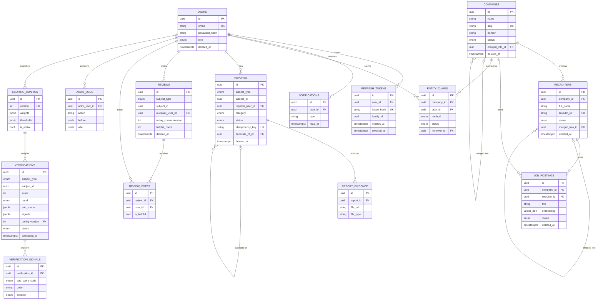

# Schema — VeriHire

Source of truth: `apps/api/app/modules/*/models.py` (SQLAlchemy 2.0). This
document is a readable companion, not a substitute — regenerate the diagram
below whenever a migration changes relationships.

Every table has a UUIDv7 primary key (`id`) and every foreign key has an
explicit `ondelete` policy (see the table below the diagram). `verifications`,
`reports` and `reviews` attach to their subject polymorphically via
`(subject_type, subject_id)` rather than a foreign key, since a subject may be
a company, a recruiter or a job posting.

## Entity-relationship diagram



## Native Postgres enum types

| Type | Values |
|---|---|
| `user_role` | seeker, employer, moderator, admin |
| `trust_band` | unrated, high_risk, caution, trusted |
| `subject_type` | company, recruiter, job_posting |
| `entity_status` | unverified, claimed, verified, flagged, merged, removed |
| `report_category` | advance_fee, fake_job_posting, impersonation, data_harvesting, pyramid_scheme, interview_scam, payment_scam, other |
| `report_status` | pending, under_review, confirmed, rejected, appealed |
| `claim_method` | dns_txt, email_domain |
| `claim_status` | pending, approved, rejected |
| `signal_severity` | info, low, medium, high, critical |
| `sub_score_code` | identity, company_legitimacy, content_risk, link_safety, community_signal |
| `verification_status` | pending, resolving, fetching, analysing, scoring, done, failed |

Enum columns are built through `app.core.enums.pg_enum(...)`, which stores
each member's lowercase `.value` in Postgres rather than SQLAlchemy's default
of the Python member name — keeping the database, the API, and seed data in
the same vocabulary.

## Notable indexes

| Table | Index | Purpose |
|---|---|---|
| `companies` | GIN `gin_trgm_ops` on `name` | fuzzy company search |
| `recruiters` | GIN `gin_trgm_ops` on `full_name` | fuzzy recruiter search |
| `job_postings` | GIN `gin_trgm_ops` on `title` | fuzzy posting search |
| `job_postings` | HNSW `vector_cosine_ops` on `embedding` | semantic similarity |
| `verifications` | btree `(subject_type, subject_id, computed_at desc)` | latest score per subject |
| `verifications` | GIN `jsonb_path_ops` on `signals` | filter by signal code |
| `reports` | partial btree on `status` where `status = 'pending'` | moderation queue |

## Immutability & soft delete

- `verifications` rows are never updated after insert — recomputation always
  inserts a new row (`Verification` has no `updated_at`). Score history and
  diffs read from this append-only log.
- User-generated content (`companies`, `recruiters`, `job_postings`,
  `reports`, `reviews`) carries `deleted_at` for soft delete. GDPR-style hard
  deletion of a `User` cascades their `refresh_tokens`/`notifications` and
  nulls out `reporter_user_id` / `reviewer_user_id` on their reports/reviews
  (`ON DELETE SET NULL`) so community signal survives account deletion in
  anonymised form.

## Verifying the migration

```bash
cd apps/api
uv run alembic upgrade head
uv run alembic downgrade base
uv run alembic upgrade head
```
